# docker-zadanie1-geoip-server-basic
This project showcases the process of building docker image with server side application which response with client's IP and time.

## Table of Contents

- [Requirements](#requirements)
- [Server application](#server-application)
- [Dockerfile](#dockerfile)
- [Image Building](#image-building)
- [Container Running](#container-running)
- [Diagnostics](#diagnostics)
- [Repository And Scouting](repository-and-scouting)

## Requirements

For Linux and Windows systems Docker or Docker Desktop must be installed and running.

For Windows systems WSL must be installed.

## Server application

The code of server application with comments.

```node
const http = require('http');
const geoip = require('geoip-lite');

// Function handling HTTP requests
const requestHandler = (request, response) => {
  // Get client's IP address
  const clientIP = request.socket.remoteAddress;

  // Get client's IP address from X-Forwarded-For header
  const clientForwardedIPs = request.headers['x-forwarded-for'];

  // Determine the real client IP address (based on X-Forwarded-For header or the IP address from HTTP header if X-Forwarded-For header is not defined)
  const clientRealIP = (clientForwardedIPs && clientForwardedIPs.split(',')[0].trim()) || clientIP;

  // Determine client's timezone and location based on IP address (if fails, default to UTC timezone with en locale format)
  const clientGeo = geoip.lookup(clientRealIP);
  const clientTimeZone = clientGeo && clientGeo.timezone ? clientGeo.timezone : 'UTC';
  const clientLocale = clientGeo && clientGeo.country ? clientGeo.country.toLowerCase() : 'en';

  // Get client's date and time in client's timezone
  const clientTime = new Date().toLocaleString(clientLocale, {timeZone: clientTimeZone});

  // Get server's date and time
  const serverTime = new Date().toLocaleString(clientLocale);

  // Set response header
  response.writeHead(200, {'Content-Type': 'text/html'});

  // Generate page content
  const htmlContent = `
    <html>
      <head>
        <title>Client Data</title>
      </head>
      <body>
        <h1>Client Data</h1>
        <p>Client IP address: ${clientRealIP}</p>
        <p>Client timezone: ${clientTimeZone}</p>
        <p>Date and time in client's timezone: ${clientTime}</p>
        <p>Server date and time: ${serverTime}</p>
      </body>
    </html>
  `;

  // Send response to client
  response.end(htmlContent);
};

// Create HTTP server
const server = http.createServer(requestHandler);

// Configure host
const host = '0.0.0.0';

// Configure port (if not defined in PORT environment variable, set to 3000)
const port = process.env.PORT || 3000;

// Run the server
server.listen(port, host, (err) => {
  if (err) {
    return console.log('Error while starting the server:', err);
  }

  // Get current date and time
  const currentDate = new Date().toLocaleString('pl-PL');

  // Display server startup information
  console.log(`Server has been started on port ${port}, date: ${currentDate}, author: Jakub Kopeć`);
});
```

Server app was tested on public server, because on localhost shows only local address. For testing VPN was used on British server to confirm that server working also for public responses.

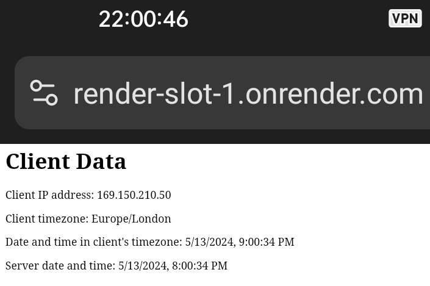

Link: [render-slot-1.onrender.com](https://render-slot-1.onrender.com/)

## Dockerfile

Two stage Dockerfile devided into building and running part.

```dockerfile
# Stage 1: Application Building

FROM node:20.13.1-alpine as build

WORKDIR /server-app

COPY package*.json ./

COPY server.js ./

# Only geoip-lite is needed for this project
RUN npm install geoip-lite


# Stage 2: Application Run

FROM node:20.13.1-alpine as production

LABEL org.opencontainers.image.authors="Jakub Kopeć"

WORKDIR /server-app

COPY --from=build /server-app .

# Port 3000 is exposed but if PORT is set in the environment variable it will be used instead
EXPOSE 3000

RUN apk add --no-cache curl

HEALTHCHECK --interval=30s --timeout=5s CMD curl -f http://localhost:3000 || exit 1

CMD ["node", "server.js"]


# Build the image

# docker build -t geoip-server .

# Run the container

# docker run -d -p 3000:3000 --name ip-check-server geoip-server

# Get logs

# docker logs ip-check-server

# Check how many layers are in the image

# docker inspect --format="{{len .RootFS.Layers}}" geoip-server
```

## Image Building

Example for Windows:

Run the command below to build an image. Change the '-t' parameter value to your desired image name.

```cmd
docker build -t geoip-server .
```

Result:

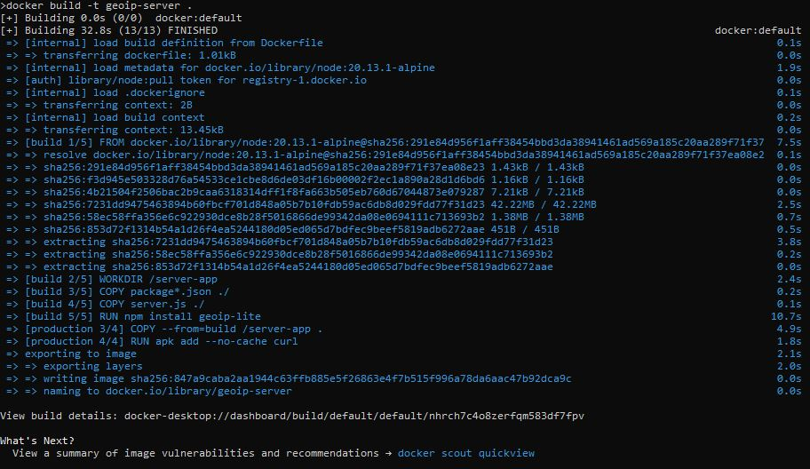

## Container Running

Run the command below to run an container. Change the '-p' parameter value to your desired ports and '--name' to your desired name of container.

```cmd
docker run -d -p 3000:3000 --name ip-check-server geoip-server
```

Result:

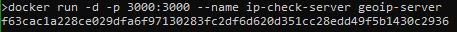

## Diagnostics

Checking logs of server container.

```cmd
docker logs ip-check-server
```

Result:

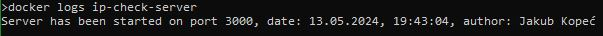

Checking number of image layers.

```cmd
docker inspect --format="{{len .RootFS.Layers}}" geoip-server
```

Result:

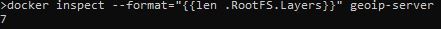

Checking if container is healthy.

```cmd
docker ps --filter name=ip-check-server
```

Result:

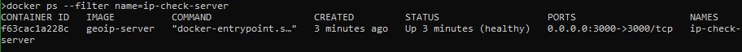

Checking if service is working on web browser. Put 'http://localhost:3000' into search bar.

Result:

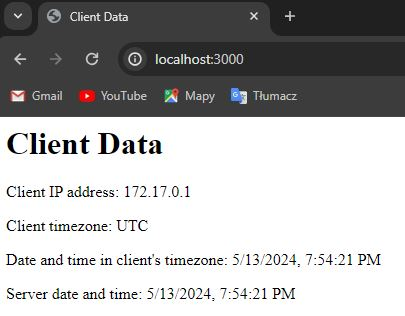

## Repository And Scouting

Create repository on [dockerhub.io](https://dockerhub.io) on your account.

Enroll your account.

```cmd
docker scout enroll eyelor
```

Result:

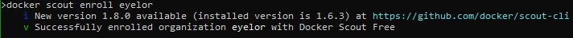

Enroll your repository.

```cmd
docker scout repo enable --org eyelor eyelor/zadanie1
```

Result:

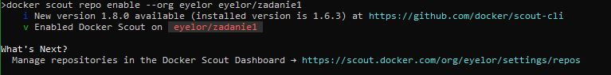

Push your image to your repository.

```cmd
docker build -q -t docker.io/eyelor/zadanie1:geoip-server-basic --platform linux/amd64 --push .
```

Result:

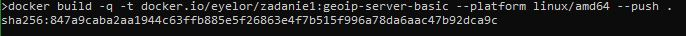

Now perform scout image scanning using cves showing only critical and high severities.

```cmd
docker cves --only-severity critical,high eyelor/zadanie1:geoip-server-basic
```

Result:

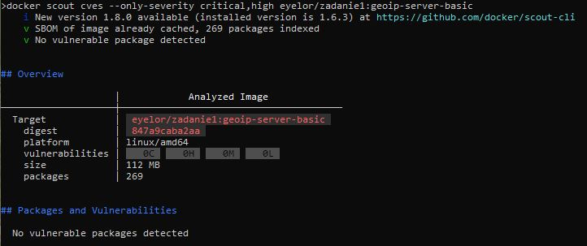

There is no critical and high severities.

Link to this image: [hub.docker.com/layers/eyelor/zadanie1/geoip-server-basic/images/sha256-7c32d1136cca6b611a53eea12f8fa7c0c45b66b61c8119b7b5160d14c3abfdeb](https://hub.docker.com/layers/eyelor/zadanie1/geoip-server-basic/images/sha256-7c32d1136cca6b611a53eea12f8fa7c0c45b66b61c8119b7b5160d14c3abfdeb)

